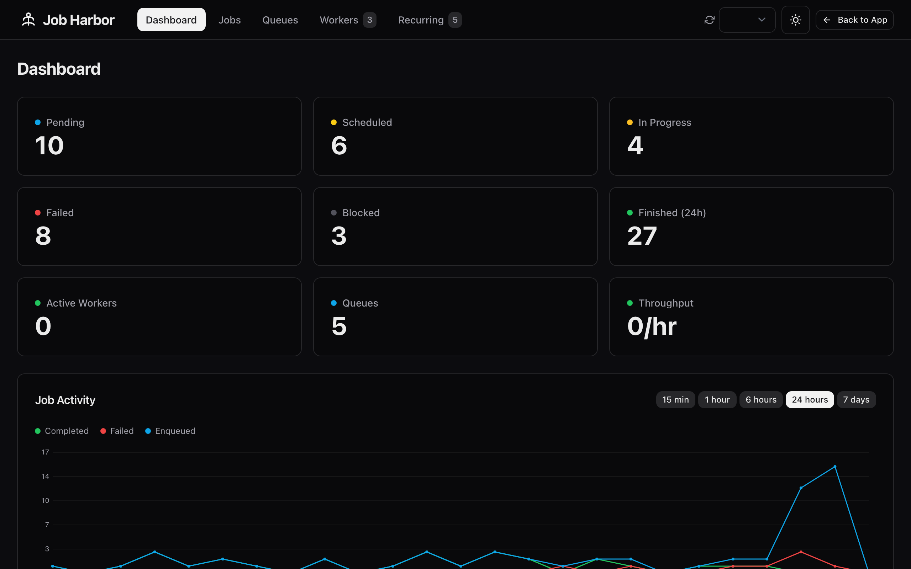
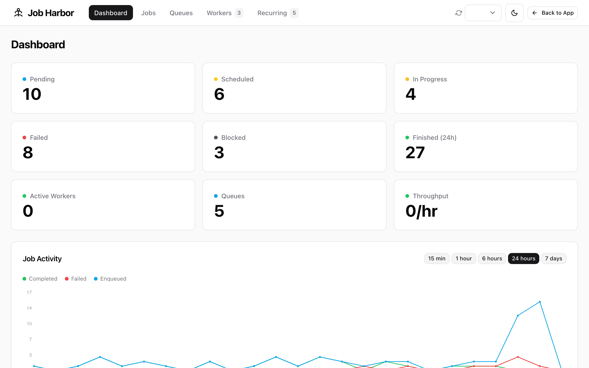
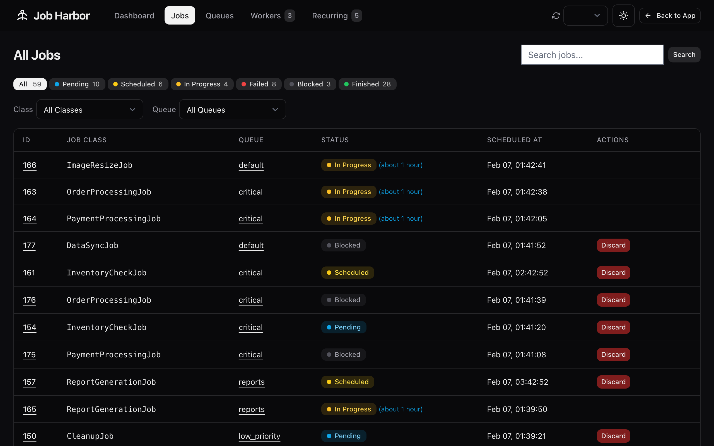
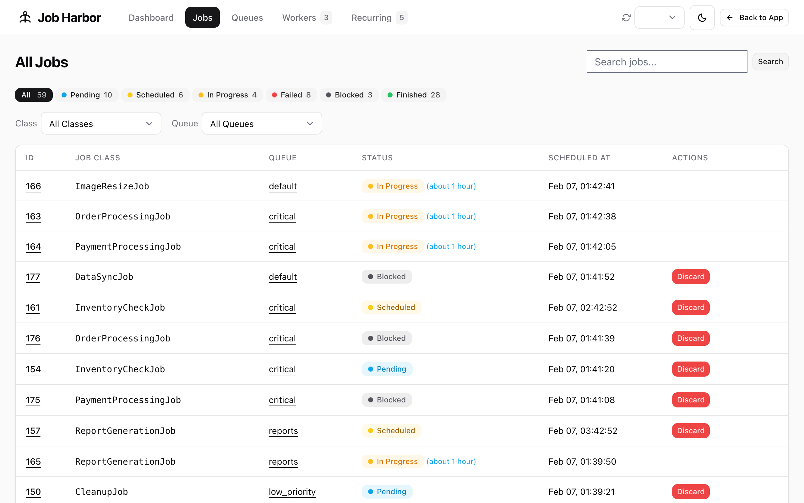
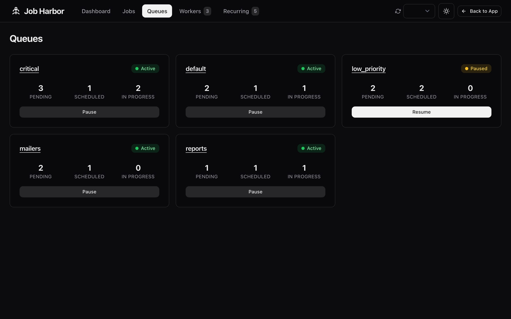
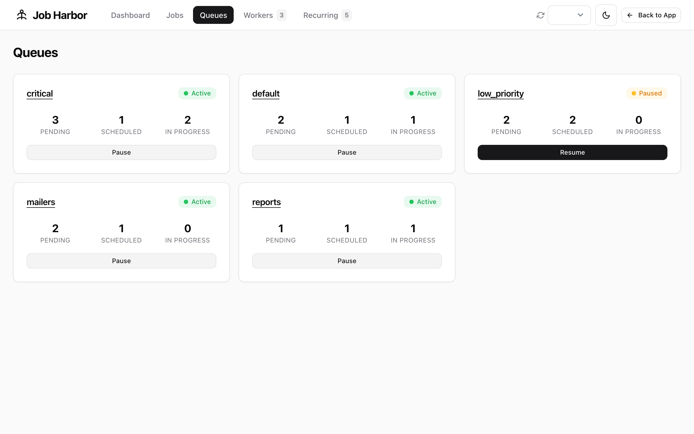
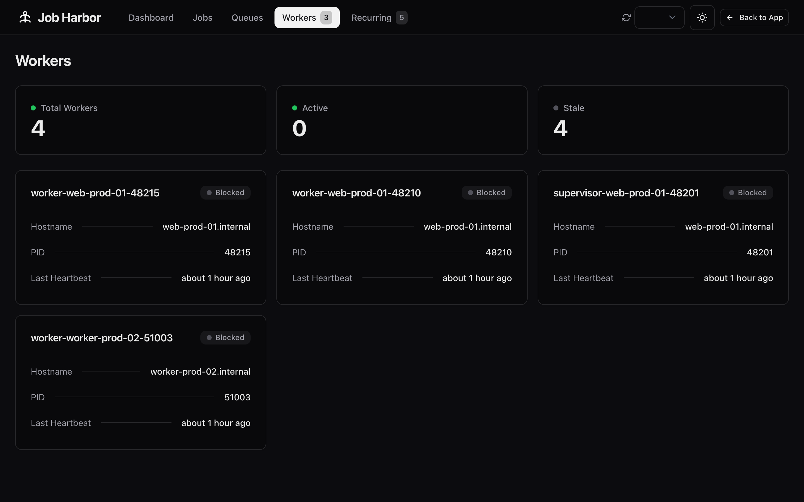
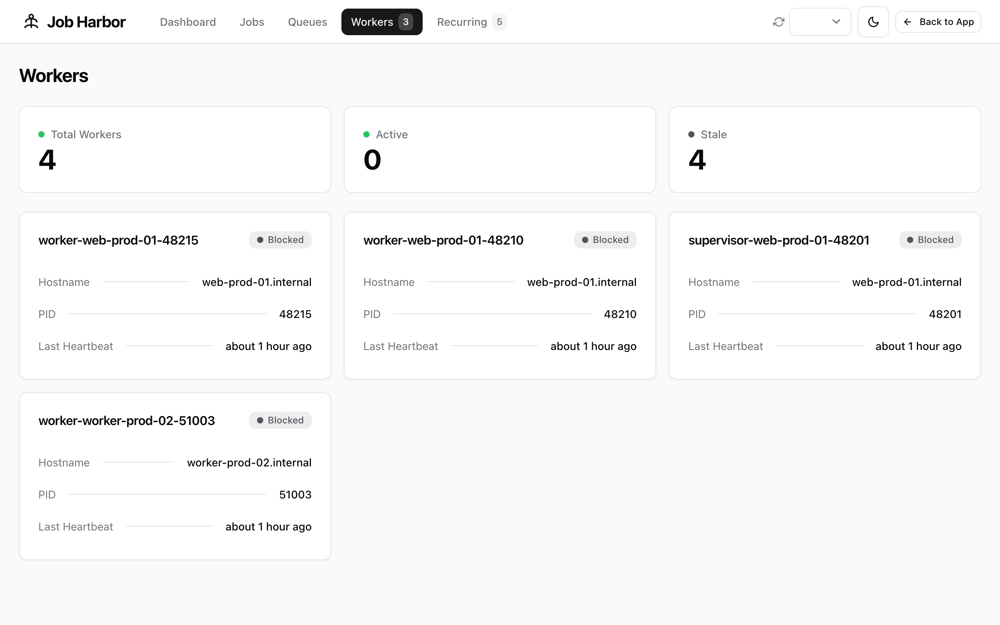
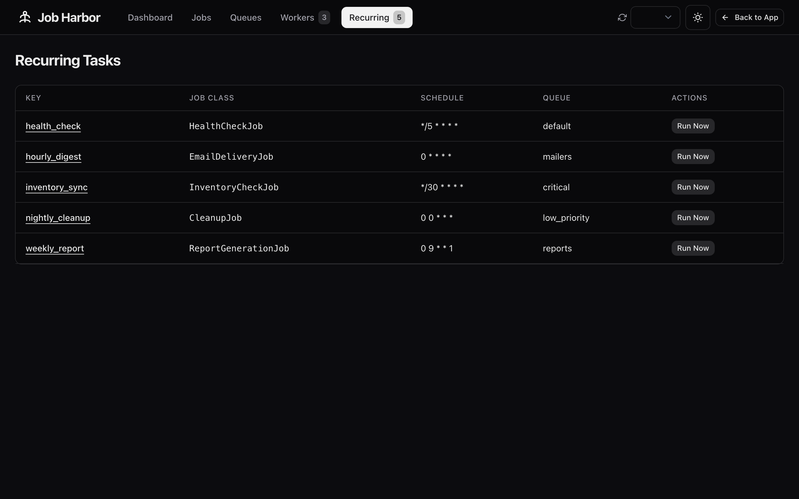
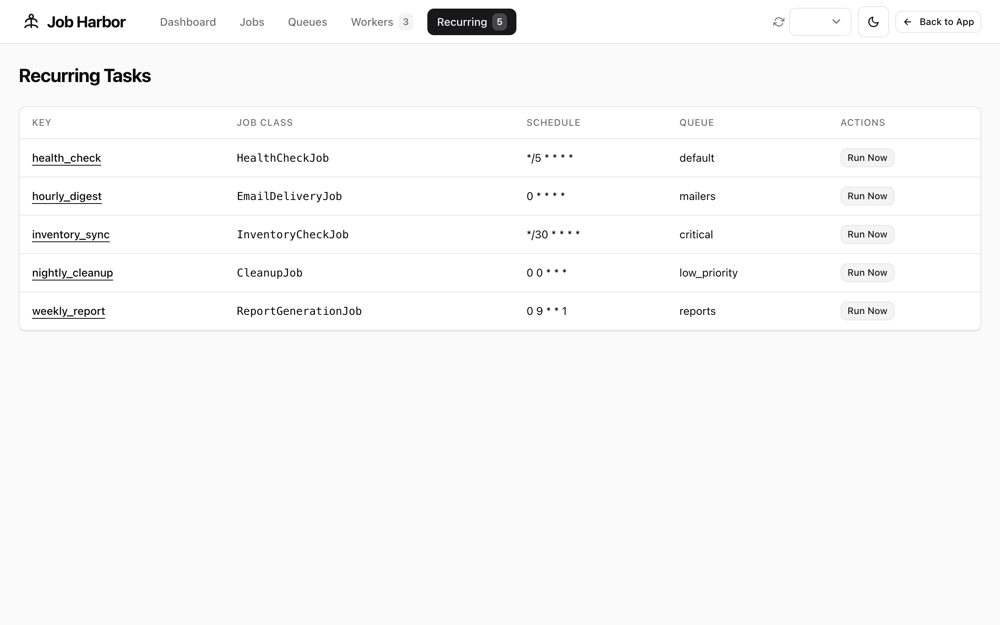

# Job Harbor

A modern, beautiful dashboard for monitoring and managing [Solid Queue](https://github.com/rails/solid_queue) jobs in Rails. Built with ViewComponents and a shadcn/ui-inspired design system.



## Features

- **Dashboard Overview** - Real-time statistics, job activity charts, failure rates, and recent failures at a glance
- **Job Management** - View, search, filter, retry, and discard jobs with full argument and error inspection
- **Queue Management** - Monitor queue health, pause and resume queues
- **Worker Monitoring** - Track active workers with heartbeat status and hostname details
- **Recurring Tasks** - View schedules and manually trigger recurring jobs
- **Auto-Refresh** - Configurable polling interval keeps data current
- **Dark/Light Themes** - Toggle between themes with localStorage persistence

## Screenshots

<details>
<summary>Dashboard</summary>

| Dark | Light |
|------|-------|
|  |  |

</details>

<details>
<summary>Jobs</summary>

| Dark | Light |
|------|-------|
|  |  |

</details>

<details>
<summary>Queues</summary>

| Dark | Light |
|------|-------|
|  |  |

</details>

<details>
<summary>Workers</summary>

| Dark | Light |
|------|-------|
|  |  |

</details>

<details>
<summary>Recurring Tasks</summary>

| Dark | Light |
|------|-------|
|  |  |

</details>

## Installation

Add to your Gemfile:

```ruby
gem "job_harbor"
```

Then run:

```bash
bundle install
```

## Mounting

Mount the engine in your routes:

```ruby
# config/routes.rb
Rails.application.routes.draw do
  mount JobHarbor::Engine, at: "/job_harbor"
end
```

Or with an authentication constraint:

```ruby
authenticated :user, ->(u) { u.admin? } do
  mount JobHarbor::Engine, at: "/admin/jobs"
end
```

## Configuration

Create an initializer at `config/initializers/job_harbor.rb`:

```ruby
JobHarbor.configure do |config|
  # Authorization - must return true to allow access (default: open)
  config.authorize_with = -> { current_user&.admin? }

  # Theme: :dark or :light (default: :dark)
  config.theme = :dark

  # Jobs per page (default: 25)
  config.jobs_per_page = 25

  # Auto-refresh polling interval in seconds (default: 5)
  config.poll_interval = 5

  # Toggle features on/off
  config.enable_recurring_tasks = true   # default: true
  config.enable_real_time_updates = true # default: true
  config.enable_failure_stats = true     # default: true
  config.enable_charts = true            # default: true

  # Default chart time range (default: "24h")
  config.default_chart_range = "24h"

  # "Back to App" link in the navbar (default: nil, hidden)
  config.return_to_app_path = "/"
  config.return_to_app_label = "Back to App"

  # Also accepts a proc for dynamic paths:
  # config.return_to_app_path = -> { main_app.root_path }
end
```

## Authorization

The dashboard uses a configurable authorization callback. Return `true` to allow access:

```ruby
# Allow all (default - not recommended for production)
config.authorize_with = -> { true }

# Require authentication
config.authorize_with = -> { current_user.present? }

# Require admin role
config.authorize_with = -> { current_user&.admin? }

# Use Pundit or similar
config.authorize_with = -> { authorize(:job_harbor, :manage?) }
```

## Requirements

- Ruby >= 3.2
- Rails >= 7.1
- Solid Queue >= 0.3
- ViewComponent >= 3.0

## License

MIT License. See [LICENSE](LICENSE) for details.
